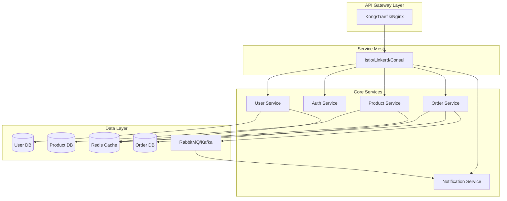
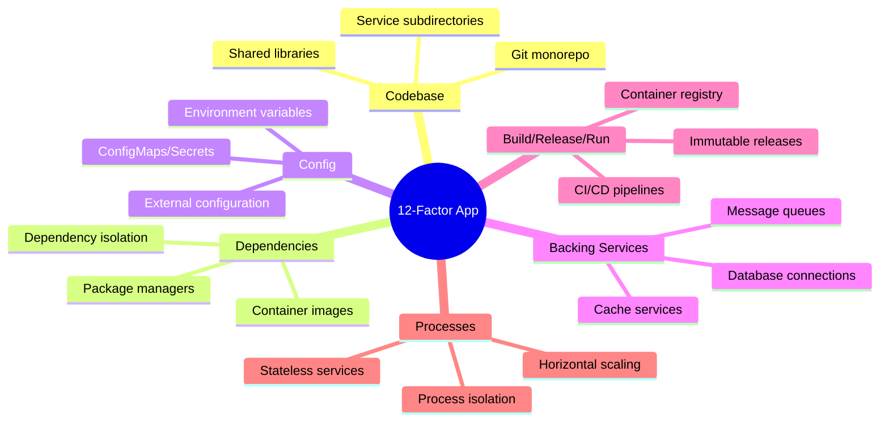
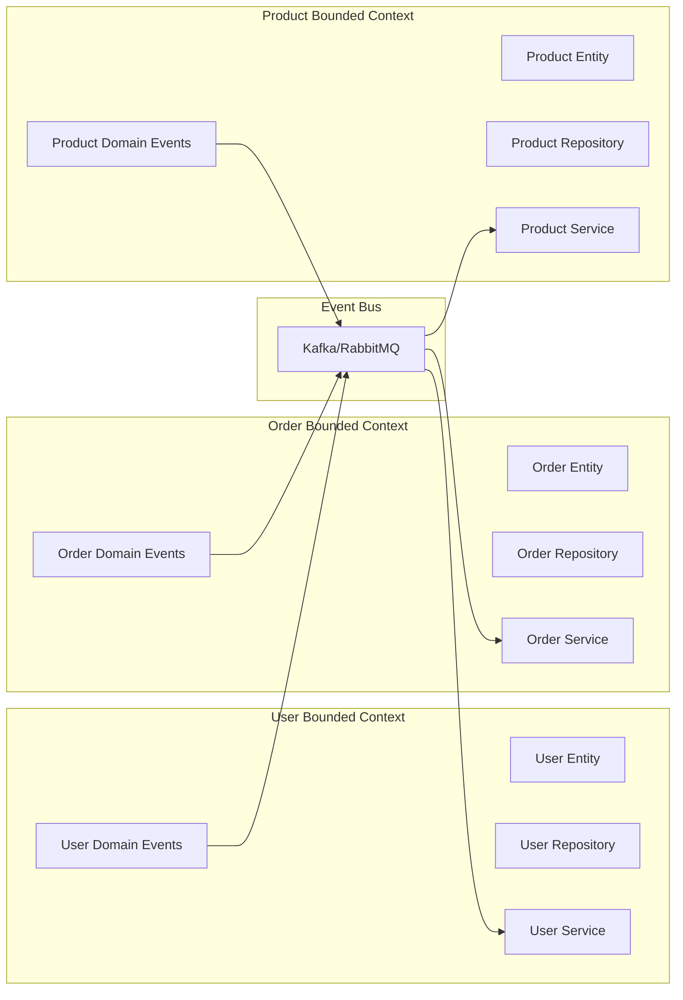
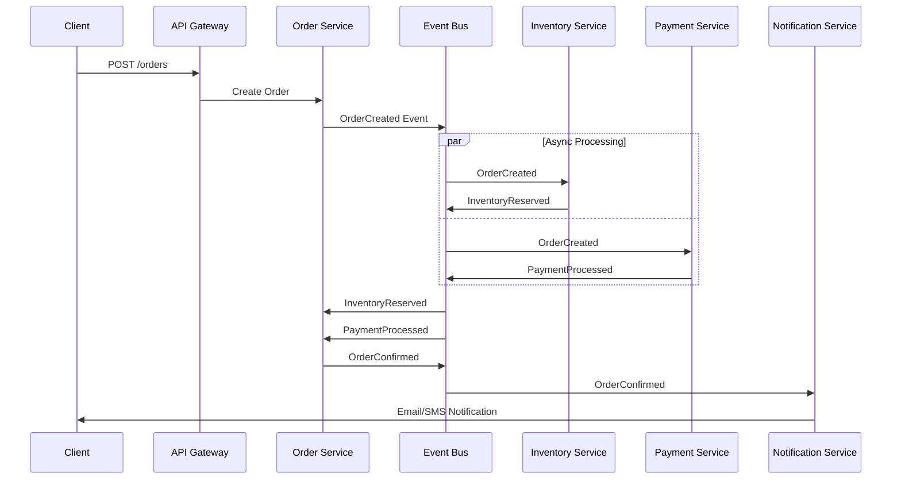
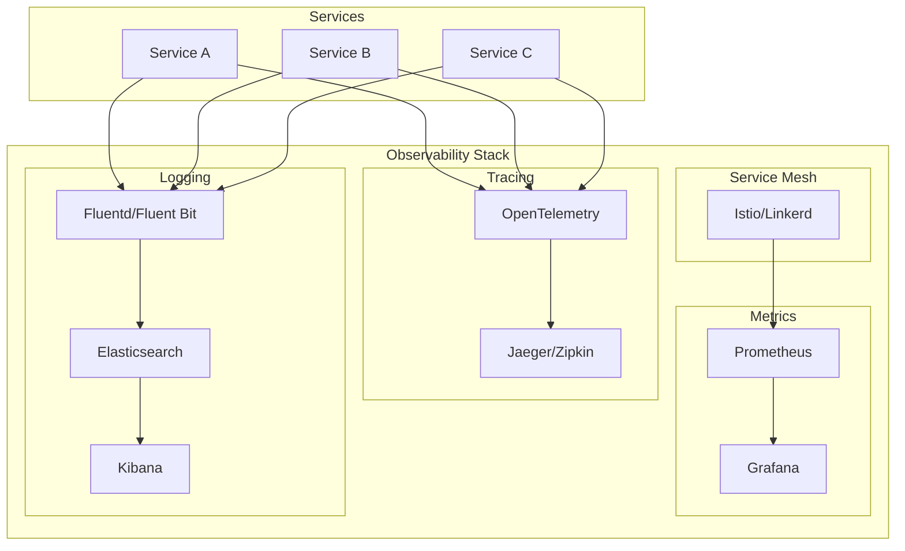
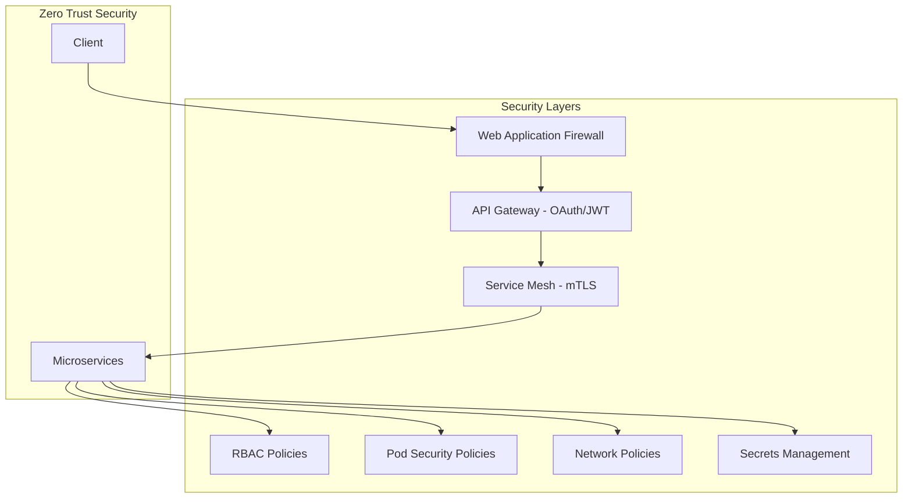
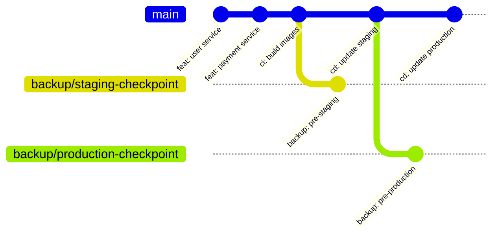

# Architecture Microservices Design Command

**ALWAYS THINK THEN...** Before executing any action, operation, or command in this instruction set, you MUST use thinking to:
1. Analyze the request and understand what needs to be done
2. Plan your approach and identify potential issues
3. Consider the implications and requirements
4. Only then proceed with the actual execution

**This thinking requirement is MANDATORY and must be followed for every action.**

## CANONICAL PROTOCOL ENFORCEMENT - READ FIRST

**THIS SECTION IS MANDATORY AND MUST BE READ, INDEXED, AND FOLLOWED BEFORE ANY COMMAND EXECUTION**

**BEFORE PROCEEDING, YOU MUST:**
1. **READ AND INDEX**: `C:\github_development\ai-agents\.claude\commands\ai-agent-compliance.md`
2. **VERIFY**: User has given explicit permission to proceed
3. **ACKNOWLEDGE**: ALL CANONICAL PROTOCOL requirements

**BINDING COMMITMENT**: I hereby commit to strict, unwavering adherence to ALL ai-agent-compliance.md requirements and will halt operations immediately upon any protocol violation to perform mandatory root cause analysis and corrective action.

**FORBIDDEN**: Proceeding without complete protocol compliance verification

## FORBIDDEN PRACTICES

**FORBIDDEN PRACTICES:**
- Making large, non-atomic changes
- Skipping tests or validation
- Ignoring build/deploy errors
- Proceeding without understanding
- Creating duplicate functionality
- Using outdated patterns

**ABSOLUTELY FORBIDDEN - NO EXCEPTIONS:**
- **NO MOCKING** of data or services in production code
- **NO TODOs** - complete ALL work immediately
- **NO SHORTCUTS** - implement properly ALWAYS
- **NO STUBS** - write complete implementations
- **NO FIXED DATA** - use real, dynamic data
- **NO HARDCODED VALUES** - use configuration
- **NO WORKAROUNDS** - fix root causes
- **NO FAKE IMPLEMENTATIONS** - real code only
- **NO PLACEHOLDER CODE** - production-ready only
- **NO TEMPORARY SOLUTIONS** - permanent fixes only

## RTFM (READ THE FUCKING MANUAL) - MANDATORY

**YOU MUST ALWAYS:**

1. **READ JUPYTER NOTEBOOKS:**
   - Search for .ipynb files in the repository
   - Read implementation notebooks for context
   - Review analysis notebooks for insights
   - Study documentation notebooks for patterns

2. **READ PROJECT DOCUMENTATION:**
   - Check `./docs` directory thoroughly
   - Check `./project/docs` if it exists
   - Read ALL README files
   - Review architecture documentation
   - Study API documentation

3. **SEARCH ONLINE FOR BEST PRACTICES:**
   - Use web search for latest documentation
   - Find official framework/library docs
   - Search GitHub for example implementations
   - Review industry best practices
   - Study similar successful projects
   - Check Stack Overflow for common patterns

**SEARCH PRIORITIES:**
- Official documentation (latest version)
- GitHub repositories with high stars
- Industry standard implementations
- Recent blog posts/tutorials (< 1 year old)
- Community best practices

---

## INSTRUCTIONS

Generate comprehensive microservices architecture documentation following cloud-native principles for: $argument

## Architecture Framework

This command follows established open source microservices patterns and frameworks:
- **12-Factor App** methodology
- **Cloud Native Computing Foundation (CNCF)** principles
- **Domain-Driven Design (DDD)** patterns
- **Event-Driven Architecture** patterns
- **Service Mesh** architecture
- **API-First** design principles

## Core Architecture Components

### 1. Service Decomposition & Boundaries



**Required Documentation:**
- Service boundaries following DDD bounded contexts
- Service contracts and API specifications (OpenAPI 3.0)
- Data ownership and consistency boundaries
- Service dependencies and coupling analysis
- Autonomous service criteria checklist

### 2. 12-Factor App Compliance

#### Factor Checklist and Implementation


**Required Documentation:**
- [ ] I. Codebase - One codebase tracked in revision control
- [ ] II. Dependencies - Explicitly declare and isolate dependencies
- [ ] III. Config - Store config in the environment
- [ ] IV. Backing services - Treat backing services as attached resources
- [ ] V. Build, release, run - Strictly separate build and run stages
- [ ] VI. Processes - Execute the app as one or more stateless processes
- [ ] VII. Port binding - Export services via port binding
- [ ] VIII. Concurrency - Scale out via the process model
- [ ] IX. Disposability - Maximize robustness with fast startup and graceful shutdown
- [ ] X. Dev/prod parity - Keep development, staging, and production as similar as possible
- [ ] XI. Logs - Treat logs as event streams
- [ ] XII. Admin processes - Run admin/management tasks as one-off processes

### 3. Cloud Native Architecture Patterns

```mermaid
C4Container
    title Cloud Native Microservices Architecture

    Person(user, "User", "Service consumer")

    System_Boundary(cdn, "CDN") {
        Container(cloudflare, "Cloudflare", "CDN", "Global edge caching")
    }

    System_Boundary(k8s, "Kubernetes Cluster") {
        Container(ingress, "Ingress Controller", "NGINX", "Load balancing & SSL termination")
        Container(gateway, "API Gateway", "Kong", "Rate limiting, auth, routing")
        Container(mesh, "Service Mesh", "Istio", "Service discovery, observability")

        System_Boundary(services, "Microservices") {
            Container(auth, "Auth Service", "Go", "JWT authentication")
            Container(user, "User Service", "Node.js", "User management")
            Container(product, "Product Service", "Java", "Product catalog")
            Container(order, "Order Service", "Python", "Order processing")
        }

        System_Boundary(data, "Data Stores") {
            ContainerDb(postgres, "PostgreSQL", "RDBMS", "Transactional data")
            ContainerDb(mongo, "MongoDB", "NoSQL", "Product catalog")
            ContainerDb(redis, "Redis", "Cache", "Session & cache")
            ContainerQueue(kafka, "Kafka", "Event Stream", "Event backbone")
        }
    }

    Rel(user, cloudflare, "HTTPS")
    Rel(cloudflare, ingress, "HTTPS")
    Rel(ingress, gateway, "HTTP")
    Rel(gateway, mesh, "gRPC/HTTP")
    Rel(mesh, services, "gRPC/HTTP")
    Rel(services, data, "TCP")
```

**Required Patterns:**
- Container orchestration with Kubernetes
- Service mesh for inter-service communication
- API gateway for external access
- Circuit breakers and retry patterns
- Distributed tracing and observability
- Health checks and self-healing

### 4. Domain-Driven Design Integration



**DDD Requirements:**
- Bounded context mapping
- Aggregate root identification
- Domain events and event sourcing
- CQRS implementation patterns
- Anti-corruption layers
- Context mapping strategies

### 5. API Design & Management

```yaml
# OpenAPI 3.0 Specification Template
openapi: 3.0.3
info:
  title: Microservice API
  version: 1.0.0
  description: |
    RESTful API following:
    - REST maturity level 3 (HATEOAS)
    - JSON:API or HAL specification
    - Versioning strategy (URL/Header)
    - Rate limiting headers
    - Correlation ID tracking
servers:
  - url: https://api.example.com/v1
paths:
  /resources:
    get:
      operationId: listResources
      parameters:
        - $ref: '#/components/parameters/pagination'
        - $ref: '#/components/parameters/filtering'
      responses:
        200:
          description: Success
          headers:
            X-Rate-Limit-Remaining:
              schema:
                type: integer
```

**API Requirements:**
- OpenAPI 3.0 specifications for all services
- API versioning strategy
- Rate limiting and throttling
- Request/response correlation
- Error handling standards
- HATEOAS implementation

### 7. Event-Driven Architecture



**Event Architecture Requirements:**
- Event schema registry
- Event sourcing patterns
- Saga pattern implementation
- Compensating transactions
- Event replay capabilities
- Dead letter queue handling

### 8. Observability & Monitoring



**Observability Requirements:**
- Distributed tracing (OpenTelemetry)
- Metrics collection (Prometheus)
- Centralized logging (ELK/EFK stack)
- Service mesh observability
- SLI/SLO/SLA definitions
- Alerting and incident response

### 9. Security Architecture



**Security Requirements:**
- Zero trust network architecture
- mTLS between services
- OAuth 2.0/OIDC implementation
- API key management
- Secrets rotation (HashiCorp Vault)
- Container image scanning
- Runtime security (Falco)

### 9. Deployment & GitOps



**Deployment Requirements:**
- GitOps workflow (ArgoCD/Flux)
- Progressive delivery (Flagger)
- Blue-green deployments
- Canary releases
- Feature flags (LaunchDarkly)
- Rollback procedures
- Disaster recovery

### 10. Service Mesh Configuration

```yaml
# Istio VirtualService Example
apiVersion: networking.istio.io/v1beta1
kind: VirtualService
metadata:
  name: user-service
spec:
  hosts:
  - user-service
  http:
  - match:
    - headers:
        version:
          exact: v2
    route:
    - destination:
        host: user-service
        subset: v2
      weight: 20  # Canary 20%
    - destination:
        host: user-service
        subset: v1
      weight: 80  # Stable 80%
  - route:
    - destination:
        host: user-service
        subset: v1
```

### Documentation Deliverables

1. **Architecture Decision Records (ADRs)**
   - Technology choices with rationale
   - Trade-off analysis
   - Migration strategies

2. **Service Catalog**
   - Service inventory with owners
   - API documentation links
   - Dependency mapping
   - SLA definitions

3. **Operations Runbook**
   - Deployment procedures
   - Incident response playbooks
   - Scaling guidelines
   - Monitoring dashboards

4. **Development Guidelines**
   - Local development setup
   - Testing strategies
   - Code review checklist
   - Performance benchmarks

### Quality Checklist

#### Architecture Compliance
- [ ] All services follow 12-Factor App principles
- [ ] DDD bounded contexts properly defined
- [ ] Event-driven patterns implemented
- [ ] Service mesh configured for all services
- [ ] Zero trust security implemented
- [ ] Observability stack fully integrated

#### Documentation Completeness
- [ ] All services have OpenAPI specifications
- [ ] Architecture diagrams use standard notation
- [ ] Runbooks cover common scenarios
- [ ] ADRs document key decisions
- [ ] Performance benchmarks documented
- [ ] Security controls documented

#### Operational Readiness
- [ ] CI/CD pipelines configured
- [ ] Monitoring dashboards created
- [ ] Alerts and SLOs defined
- [ ] Backup and recovery tested
- [ ] Load testing completed
- [ ] Security scanning integrated

Generate comprehensive microservices architecture documentation following these cloud-native principles and patterns.
