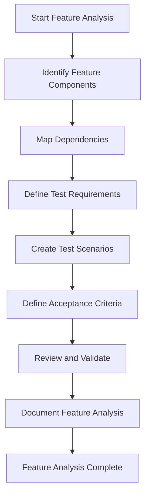
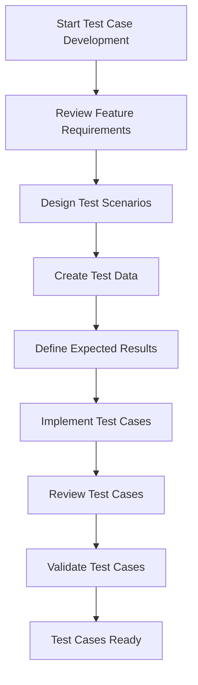
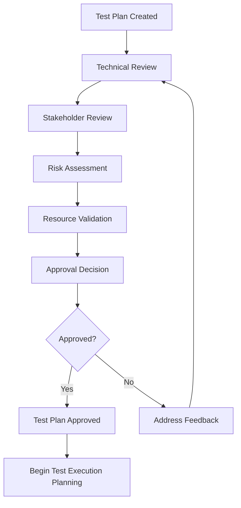

# === Universal Code Test Planning Framework: AI-Driven Test Strategy and Framework Development Protocol ===

**ALWAYS THINK THEN...** Before executing any action, operation, or command in this instruction set, you MUST use thinking to:
1. Analyze the request and understand what needs to be done
2. Plan your approach and identify potential issues
3. Consider the implications and requirements
4. Only then proceed with the actual execution

**This thinking requirement is MANDATORY and must be followed for every action.**

## CANONICAL PROTOCOL ENFORCEMENT - READ FIRST

**THIS SECTION IS MANDATORY AND MUST BE READ, INDEXED, AND FOLLOWED BEFORE ANY COMMAND EXECUTION**

**BEFORE PROCEEDING, YOU MUST:**
1. **READ AND INDEX**: `.claude/commands/ai-agent-compliance.md`
2. **READ AND INDEX**: `.claude/commands/core/code-protocol-compliance-prompt.md`
3. **READ AND INDEX**: `.claude/commands/test/test-protocol-service-examples.md`
4. **VERIFY**: User has given explicit permission to proceed
5. **ACKNOWLEDGE**: ALL CANONICAL PROTOCOL requirements

**BINDING COMMITMENT**: I hereby commit to strict, unwavering adherence to ALL ai-agent-compliance.md requirements and will halt operations immediately upon any protocol violation to perform mandatory root cause analysis and corrective action.

**FORBIDDEN**: Proceeding without complete protocol compliance verification

## FORBIDDEN PRACTICES

**FORBIDDEN PRACTICES:**
- Making large, non-atomic changes
- Skipping tests or validation
- Ignoring build/deploy errors
- Proceeding without understanding
- Creating duplicate functionality
- Using outdated patterns

**ABSOLUTELY FORBIDDEN - NO EXCEPTIONS:**
- **NO MOCKING** of data or services in production code
- **NO TODOs** - complete ALL work immediately
- **NO SHORTCUTS** - implement properly ALWAYS
- **NO STUBS** - write complete implementations
- **NO FIXED DATA** - use real, dynamic data
- **NO HARDCODED VALUES** - use configuration
- **NO WORKAROUNDS** - fix root causes
- **NO FAKE IMPLEMENTATIONS** - real code only
- **NO PLACEHOLDER CODE** - production-ready only
- **NO TEMPORARY SOLUTIONS** - permanent fixes only

## RTFM (READ THE FUCKING MANUAL) - MANDATORY

**YOU MUST ALWAYS:**

1. **READ JUPYTER NOTEBOOKS:**
   - Search for .ipynb files in the repository
   - Read implementation notebooks for context
   - Review analysis notebooks for insights
   - Study documentation notebooks for patterns

2. **READ PROJECT DOCUMENTATION:**
   - Check `./docs` directory thoroughly
   - Check `./project/docs` if it exists
   - Read ALL README files
   - Review architecture documentation
   - Study API documentation

3. **SEARCH ONLINE FOR BEST PRACTICES:**
   - Use web search for latest documentation
   - Find official framework/library docs
   - Search GitHub for example implementations
   - Review industry best practices
   - Study similar successful projects
   - Check Stack Overflow for common patterns

**SEARCH PRIORITIES:**
- Official documentation (latest version)
- GitHub repositories with high stars
- Industry standard implementations
- Recent blog posts/tutorials (< 1 year old)
- Community best practices

---

## **MCP PROMPT EXECUTION INSTRUCTIONS**

**MANDATORY PROTOCOL COMPLIANCE**: This is an MCP-compliant prompt that must be executed according to Model Context Protocol standards.

### **TEST-PLANNING-FRAMEWORK-ONLY MANDATE - CRITICAL DISTINCTION**

**THIS COMMAND IS FOR TEST PLANNING FRAMEWORK DEVELOPMENT ONLY:**

- **MUST:** Implement comprehensive test planning frameworks and templates
- **MUST:** Create detailed test strategy development methodologies
- **MUST:** Generate comprehensive planning matrices and analysis tools
- **MUST:** Provide complete test planning framework documentation with timestamps
- **FORBIDDEN:** Execute ANY actual test implementations or system changes
- **FORBIDDEN:** Modify ANY production systems or test configurations
- **FORBIDDEN:** Create ANY new test cases or test executions
- **MUST:** Output planning framework results in Jupyter notebooks with timestamp tracking

**TEST PLANNING FRAMEWORK FOCUS AREAS:**

- Test strategy development frameworks and methodologies
- Comprehensive feature analysis and planning templates
- Test coverage analysis and planning matrices
- Risk assessment and priority planning frameworks
- Resource planning and timeline development tools
- Quality framework and success criteria definition
- Test automation strategy and planning frameworks

### **EXECUTION SEQUENCE:**

1. **LOAD MCP PROMPT**: Execute the MCP prompt defined in `test-protocol-planning-framework-prompt.yaml`
2. **PROVIDE ARGUMENTS**: Supply required arguments for framework_scope, methodology_depth, template_complexity
3. **FOLLOW PROTOCOL**: Execute all phases according to the planning framework protocol specifications
4. **VERIFY COMPLETION**: Ensure all planning framework objectives and template criteria have been met
5. **DOCUMENT RESULTS**: Create comprehensive planning framework documentation with timestamps
6. **VALIDATE COMPLIANCE**: Confirm 100% planning framework development and template completeness achieved

### **MCP PROMPT INVOCATION:**

```yaml
# Use this MCP prompt with required arguments:
prompt_name: "test-protocol-planning-framework-prompt"
arguments:
  framework_scope: "[comprehensive|strategic|tactical|templates-focused|methodology-focused|analysis-focused]"
  methodology_depth: "[basic|standard|advanced|enterprise|comprehensive]"
  template_complexity: "[simple|standard|detailed|enterprise|comprehensive]"
  planning_focus: "[optional: strategy|coverage|risk|automation|quality|resources]"
  framework_type: "[optional: agile|waterfall|hybrid|risk-based|exploratory]"
  customization_level: "[optional: generic|domain-specific|project-specific|organization-specific]"
```

### **SUCCESS CRITERIA:**

- [ ] MCP prompt executed with proper arguments and date stamps
- [ ] All planning framework phases completed according to protocol with timestamp tracking
- [ ] 100% comprehensive planning framework development completed
- [ ] All test strategy frameworks created and documented (timestamped)
- [ ] Complete feature analysis templates developed (timestamped)
- [ ] Coverage analysis and planning matrices created (timestamped)
- [ ] Risk assessment frameworks implemented (timestamped)
- [ ] Resource planning tools developed (timestamped)
- [ ] Quality frameworks and criteria defined (timestamped)
- [ ] All deliverables produced as specified in YAML protocol with proper timestamps

### **MANDATORY DATE STAMP REQUIREMENTS:**

**ALL TEST PLANNING FRAMEWORK OUTPUT FILES MUST USE REVERSE DATE STAMP FORMAT: YYYY-MM-DD-HHMMSS**

- [ ] All planning framework deliverables (.ipynb) have reverse date stamps in filenames
- [ ] All template documentation includes precise timestamps
- [ ] All framework development includes timestamp tracking
- [ ] All methodology documentation includes proper date stamps
- [ ] All analysis tools follow consistent date stamp format
- [ ] All planning matrices include timestamps
- [ ] All strategy frameworks include proper date stamps
- [ ] UTC time used for all timestamp operations

**FORBIDDEN:**

- Creating planning framework files without proper reverse date stamps
- Using inconsistent date formats within same framework development session
- Missing timestamps in planning framework documentation

### **TEST PLANNING FRAMEWORK DELIVERABLES WITH REVERSE DATE STAMPS:**

**MANDATORY JUPYTER NOTEBOOK DELIVERABLES:**

1. **`./project/docs/planning/test-planning/Implementation_Plan_{YYYYMMDD-HHMMSS}.ipynb`** - Complete implementation details with all components and modules
2. **`./project/docs/planning/test-planning/Testing_Strategy_{YYYYMMDD-HHMMSS}.ipynb`** - Test execution results, coverage analysis, and validation
3. **`./project/docs/planning/test-planning/Integration_Plan_{YYYYMMDD-HHMMSS}.ipynb`** - Integration patterns, dependencies, and implementation
4. **`./project/docs/planning/test-planning/Deployment_Plan_{YYYYMMDD-HHMMSS}.ipynb`** - Deployment architecture, strategy, and SOLID compliance review


**NEXT PHASE PREPARATION:**

```bash
# After planning framework development completion, apply with:
/test-planning [framework-scope] [methodology-depth] [additional-options]

# Examples:
/test-planning comprehensive enterprise
/test-planning strategic advanced
/test-planning templates-focused standard
```

---

**ENFORCEMENT:** This command performs TEST PLANNING FRAMEWORK DEVELOPMENT ONLY through the MCP prompt protocol. The comprehensive framework logic is defined in `test-protocol-planning-framework-prompt.yaml` and executed according to Model Context Protocol standards. No actual test planning or system changes are performed. Use `/test-planning` for actual planning implementation after frameworks are developed.

model_context:
  role: "AI-driven test planning framework specialist for comprehensive test strategy and template development"
  domain: "Test Planning Frameworks, Strategy Development, Template Creation, Planning Methodologies"
  goal: >
    Develop comprehensive test planning frameworks that provide structured methodologies for
    test strategy development, feature analysis, coverage planning, risk assessment, and
    resource planning. Create robust templates and tools that enable systematic and effective
    test planning using Jupyter Notebook format with frameworks, templates, methodologies,
    and planning tools including Mermaid diagrams.

configuration:

## Overview

This protocol file contains detailed test planning templates, frameworks, and methodologies. This file is referenced by the `test-protocol-planning-framework-prompt.yaml` MCP prompt and provides comprehensive planning templates, matrices, and procedures for creating exhaustive test plans.

## Test Planning Framework Templates

### 1. Comprehensive Feature Analysis Template

#### Feature Inventory Matrix Template
```yaml
# Feature Analysis Template
feature_analysis:
  feature_id: "FT001"
  feature_name: "User Authentication"
  feature_category: "Security"
  priority: "Critical"
  
  description:
    summary: "User login and authentication system"
    detailed: "Complete user authentication including login, logout, session management, and password reset"
    
  components:
    - name: "Login Form"
      type: "UI Component"
      endpoints: ["/login"]
      dependencies: ["User Database", "Session Management"]
      
    - name: "Authentication API"
      type: "Backend Service"
      endpoints: ["/api/auth/login", "/api/auth/logout", "/api/auth/refresh"]
      dependencies: ["PostgreSQL", "JWT Service"]
      
    - name: "Session Management"
      type: "Middleware"
      endpoints: ["All protected routes"]
      dependencies: ["Redis Cache", "JWT Validation"]
      
  test_requirements:
    functional_tests:
      - "Valid login credentials"
      - "Invalid login credentials"
      - "Password reset functionality"
      - "Session timeout handling"
      - "Logout functionality"
      
    security_tests:
      - "SQL injection prevention"
      - "Brute force protection"
      - "Session hijacking prevention"
      - "Password strength validation"
      - "CSRF protection"
      
    performance_tests:
      - "Login response time < 500ms"
      - "Concurrent login capacity"
      - "Session lookup performance"
      
    integration_tests:
      - "Database integration"
      - "Cache integration"
      - "API integration"
      
  acceptance_criteria:
    - "Users can log in with valid credentials"
    - "Invalid credentials are rejected"
    - "Sessions expire after configured time"
    - "Passwords meet complexity requirements"
    - "All security measures are active"
```

#### API Endpoint Mapping Template
```yaml
# API Endpoint Analysis Template
api_analysis:
  service_name: "n8n Core API"
  base_url: "http://localhost:5678/api/v1"
  
  endpoints:
    - endpoint_id: "EP001"
      path: "/workflows"
      method: "GET"
      description: "List all workflows"
      
      parameters:
        query:
          - name: "limit"
            type: "integer"
            required: false
            description: "Number of workflows to return"
            
          - name: "offset"
            type: "integer"
            required: false
            description: "Number of workflows to skip"
            
      responses:
        200:
          description: "Successful response"
          schema: "WorkflowList"
          example: |
            {
              "data": [
                {
                  "id": "workflow-1",
                  "name": "Sample Workflow",
                  "active": true,
                  "createdAt": "2024-01-01T00:00:00Z"
                }
              ],
              "total": 1
            }
            
        401:
          description: "Unauthorized"
          schema: "Error"
          
        500:
          description: "Internal server error"
          schema: "Error"
          
      test_scenarios:
        functional:
          - scenario: "Get workflows without authentication"
            expected: "401 Unauthorized"
            
          - scenario: "Get workflows with valid authentication"
            expected: "200 OK with workflow list"
            
          - scenario: "Get workflows with limit parameter"
            expected: "200 OK with limited results"
            
        performance:
          - scenario: "Response time under load"
            expected: "< 200ms response time"
            
          - scenario: "Large dataset handling"
            expected: "< 1s for 1000+ workflows"
            
        security:
          - scenario: "SQL injection attempt"
            expected: "Request safely handled"
            
          - scenario: "Authorization bypass attempt"
            expected: "401 Unauthorized"
```

### 2. Test Case Specification Templates

#### Functional Test Case Template
```yaml
# Functional Test Case Template
test_case:
  id: "TC_FUNC_001"
  title: "User Login with Valid Credentials"
  category: "Functional"
  priority: "Critical"
  component: "Authentication"
  
  description: "Verify that users can successfully log in with valid credentials"
  
  preconditions:
    - "User account exists in system"
    - "User account is active"
    - "Login page is accessible"
    
  test_data:
    - email: "test@example.com"
      password: "ValidPassword123!"
      expected_result: "Success"
      
    - email: "admin@example.com"
      password: "AdminPass456!"
      expected_result: "Success"
      
  test_steps:
    - step: 1
      action: "Navigate to login page"
      expected: "Login form is displayed"
      
    - step: 2
      action: "Enter valid email address"
      data: "test@example.com"
      expected: "Email field accepts input"
      
    - step: 3
      action: "Enter valid password"
      data: "ValidPassword123!"
      expected: "Password field accepts input (masked)"
      
    - step: 4
      action: "Click login button"
      expected: "Login request is submitted"
      
    - step: 5
      action: "Verify response"
      expected: "User is redirected to dashboard"
      
  expected_results:
    - "Login is successful"
    - "User session is created"
    - "User is redirected to appropriate page"
    - "Authentication token is generated"
    
  validation_points:
    - "HTTP response code is 200"
    - "Authentication token is valid"
    - "User session exists in database"
    - "Correct user profile is loaded"
    
  error_scenarios:
    - condition: "Database unavailable"
      expected: "Graceful error message"
      
    - condition: "Invalid token generation"
      expected: "Login fails with error"
```

#### Performance Test Case Template
```yaml
# Performance Test Case Template
performance_test:
  id: "TC_PERF_001"
  title: "API Response Time Under Load"
  category: "Performance"
  subcategory: "Load Testing"
  priority: "High"
  
  objective: "Verify API maintains acceptable response times under normal load"
  
  test_configuration:
    duration: "5 minutes"
    ramp_up: "1 minute"
    virtual_users: 50
    requests_per_second: 100
    
  target_endpoints:
    - endpoint: "/api/v1/workflows"
      method: "GET"
      weight: 40
      
    - endpoint: "/api/v1/executions"
      method: "GET"
      weight: 30
      
    - endpoint: "/api/v1/credentials"
      method: "GET"
      weight: 20
      
    - endpoint: "/api/v1/workflows/{id}"
      method: "GET"
      weight: 10
      
  performance_criteria:
    response_time:
      average: "< 200ms"
      95th_percentile: "< 500ms"
      99th_percentile: "< 1000ms"
      
    throughput:
      minimum: "90 requests/second"
      target: "100 requests/second"
      
    error_rate:
      maximum: "1%"
      target: "0.1%"
      
    resource_utilization:
      cpu: "< 80%"
      memory: "< 85%"
      disk_io: "< 70%"
      
  monitoring_points:
    - "Response time distribution"
    - "Error rate over time"
    - "Throughput over time"
    - "Database connection pool usage"
    - "Cache hit ratio"
    - "System resource utilization"
    
  success_criteria:
    - "All response time targets are met"
    - "Error rate is below threshold"
    - "System remains stable throughout test"
    - "No memory leaks detected"
    - "Database performance is acceptable"
```

### 3. Test Data Strategy Templates

#### Test Data Generation Template
```yaml
# Test Data Strategy Template
test_data_strategy:
  data_categories:
    
    user_data:
      generation_method: "Synthetic"
      volume: 1000
      retention: "Test duration + 7 days"
      
      schema:
        - field: "email"
          type: "email"
          format: "test_user_{id}@example.com"
          unique: true
          
        - field: "password"
          type: "string"
          pattern: "^(?=.*[a-z])(?=.*[A-Z])(?=.*\\d)(?=.*[@$!%*?&])[A-Za-z\\d@$!%*?&]{8,}$"
          hashed: true
          
        - field: "first_name"
          type: "string"
          source: "faker.first_name"
          
        - field: "last_name"
          type: "string"
          source: "faker.last_name"
          
        - field: "role"
          type: "enum"
          values: ["user", "admin", "operator"]
          distribution: [70, 20, 10]
          
    workflow_data:
      generation_method: "Template-based"
      volume: 500
      retention: "Test duration + 7 days"
      
      templates:
        - name: "Simple HTTP Webhook"
          nodes: 3
          complexity: "Low"
          execution_time: "< 1s"
          
        - name: "Data Processing Pipeline"
          nodes: 8
          complexity: "Medium"
          execution_time: "< 10s"
          
        - name: "Complex Integration"
          nodes: 15
          complexity: "High"
          execution_time: "< 60s"
          
    execution_data:
      generation_method: "Historical simulation"
      volume: 10000
      retention: "Test duration + 30 days"
      
      patterns:
        - pattern: "Success execution"
          frequency: 85
          duration_range: [100, 5000]
          
        - pattern: "Failed execution"
          frequency: 10
          error_types: ["timeout", "connection", "validation"]
          
        - pattern: "Cancelled execution"
          frequency: 5
          cancellation_reasons: ["user", "system", "timeout"]
```

#### Test Environment Data Management
```yaml
# Test Environment Data Management
data_management:
  environments:
    
    unit_test:
      isolation: "per_test"
      cleanup: "automatic"
      data_source: "in_memory"
      
      setup:
        - "Create minimal test data"
        - "Mock external dependencies"
        - "Initialize test database"
        
      teardown:
        - "Clear all test data"
        - "Reset mocks"
        - "Clean up resources"
        
    integration_test:
      isolation: "per_test_suite"
      cleanup: "automatic"
      data_source: "test_database"
      
      setup:
        - "Load test data fixtures"
        - "Start test services"
        - "Initialize integrations"
        
      teardown:
        - "Clean test database"
        - "Stop test services"
        - "Reset configurations"
        
    system_test:
      isolation: "per_test_run"
      cleanup: "manual"
      data_source: "dedicated_environment"
      
      setup:
        - "Deploy test environment"
        - "Load comprehensive test data"
        - "Configure monitoring"
        
      teardown:
        - "Archive test results"
        - "Clean sensitive data"
        - "Preserve logs"
        
    performance_test:
      isolation: "dedicated_environment"
      cleanup: "scheduled"
      data_source: "production_like"
      
      setup:
        - "Load performance test data"
        - "Configure monitoring"
        - "Baseline measurements"
        
      teardown:
        - "Archive performance data"
        - "Generate reports"
        - "Clean temporary data"
```

### 4. Expected vs Actual Tracking Framework

#### Tracking Matrix Template
```yaml
# Expected vs Actual Tracking Template
tracking_framework:
  test_execution_id: "TE_2024_001"
  execution_date: "2024-01-15"
  environment: "staging"
  
  tracking_categories:
    
    functional_results:
      tracking_method: "automated"
      update_frequency: "real_time"
      
      metrics:
        - metric: "test_pass_rate"
          expected: ">= 95%"
          threshold_critical: "< 90%"
          threshold_warning: "< 95%"
          
        - metric: "feature_coverage"
          expected: "100%"
          threshold_critical: "< 95%"
          threshold_warning: "< 100%"
          
    performance_results:
      tracking_method: "automated"
      update_frequency: "continuous"
      
      metrics:
        - metric: "avg_response_time"
          expected: "< 200ms"
          threshold_critical: "> 500ms"
          threshold_warning: "> 200ms"
          
        - metric: "95th_percentile_response"
          expected: "< 500ms"
          threshold_critical: "> 1000ms"
          threshold_warning: "> 500ms"
          
        - metric: "error_rate"
          expected: "< 0.1%"
          threshold_critical: "> 1%"
          threshold_warning: "> 0.1%"
          
    security_results:
      tracking_method: "automated_and_manual"
      update_frequency: "on_completion"
      
      metrics:
        - metric: "vulnerability_count"
          expected: "0"
          threshold_critical: "> 0 (high/critical)"
          threshold_warning: "> 0 (medium)"
          
        - metric: "security_test_coverage"
          expected: "100%"
          threshold_critical: "< 90%"
          threshold_warning: "< 100%"
```

#### Deviation Analysis Framework
```yaml
# Deviation Analysis Framework
deviation_analysis:
  analysis_triggers:
    - condition: "metric exceeds critical threshold"
      action: "immediate_alert"
      escalation: "automatic"
      
    - condition: "metric exceeds warning threshold"
      action: "log_deviation"
      escalation: "manual"
      
    - condition: "trend shows degradation"
      action: "trend_alert"
      escalation: "scheduled_review"
      
  analysis_procedures:
    
    performance_deviation:
      detection_method: "statistical_analysis"
      baseline_period: "last_30_days"
      sensitivity: "2_standard_deviations"
      
      investigation_steps:
        - "Compare with historical baselines"
        - "Analyze system resource utilization"
        - "Check for environmental changes"
        - "Review recent code changes"
        - "Analyze database performance"
        
    functional_deviation:
      detection_method: "threshold_based"
      comparison: "expected_vs_actual"
      
      investigation_steps:
        - "Review test case definitions"
        - "Analyze failure patterns"
        - "Check test data integrity"
        - "Review environment configuration"
        - "Examine application logs"
        
    security_deviation:
      detection_method: "zero_tolerance"
      escalation: "immediate"
      
      investigation_steps:
        - "Isolate affected components"
        - "Analyze security logs"
        - "Review access patterns"
        - "Check for policy violations"
        - "Document security incident"
```

### 5. Test Automation Strategy Templates

#### Automation Framework Selection
```yaml
# Test Automation Framework Strategy
automation_strategy:
  
  functional_testing:
    framework: "Playwright + Jest"
    coverage: "80%"
    maintenance_model: "continuous"
    
    capabilities:
      - "Cross-browser testing"
      - "API testing"
      - "Visual regression testing"
      - "Parallel execution"
      
    implementation:
      page_objects: true
      data_driven: true
      keyword_driven: false
      hybrid: true
      
  api_testing:
    framework: "Postman + Newman"
    coverage: "100%"
    maintenance_model: "continuous"
    
    capabilities:
      - "REST API testing"
      - "GraphQL testing"
      - "Authentication testing"
      - "Performance testing"
      
    implementation:
      collections: true
      environments: true
      data_files: true
      monitoring: true
      
  performance_testing:
    framework: "K6"
    coverage: "Critical paths"
    maintenance_model: "scheduled"
    
    capabilities:
      - "Load testing"
      - "Stress testing"
      - "Spike testing"
      - "Volume testing"
      
    implementation:
      scripts: "JavaScript"
      reporting: "InfluxDB + Grafana"
      ci_integration: true
      cloud_execution: true
```

#### Continuous Integration Integration
```yaml
# CI/CD Integration Template
ci_integration:
  
  pipeline_stages:
    
    commit_stage:
      triggers: ["code_commit", "pull_request"]
      tests: ["unit", "lint", "security_scan"]
      duration_target: "< 5 minutes"
      
    acceptance_stage:
      triggers: ["commit_stage_success"]
      tests: ["integration", "api", "smoke"]
      duration_target: "< 20 minutes"
      
    deployment_stage:
      triggers: ["acceptance_stage_success"]
      tests: ["deployment_verification", "health_checks"]
      duration_target: "< 10 minutes"
      
    validation_stage:
      triggers: ["deployment_stage_success"]
      tests: ["e2e", "performance", "security"]
      duration_target: "< 60 minutes"
      
  failure_handling:
    immediate_actions:
      - "Stop pipeline execution"
      - "Notify development team"
      - "Log failure details"
      - "Preserve failure evidence"
      
    escalation_procedures:
      - level_1: "Development team notification"
      - level_2: "Lead developer notification"
      - level_3: "Project manager notification"
      - level_4: "Stakeholder notification"
```

## Planning Process Workflows

### 1. Feature Analysis Workflow


### 2. Test Case Development Workflow


### 3. Test Plan Review Process


This comprehensive planning framework provides templates and procedures for creating thorough test plans that cover all aspects of the platform testing requirements.